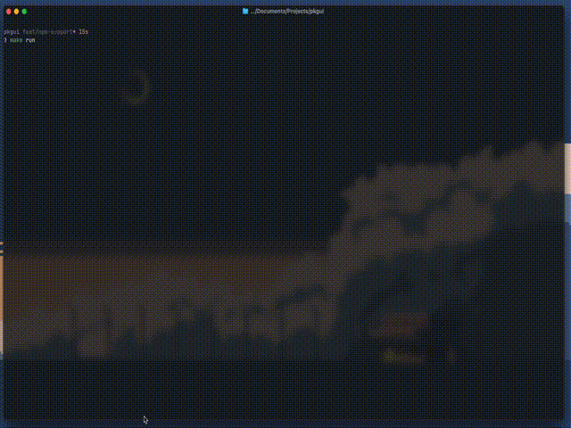
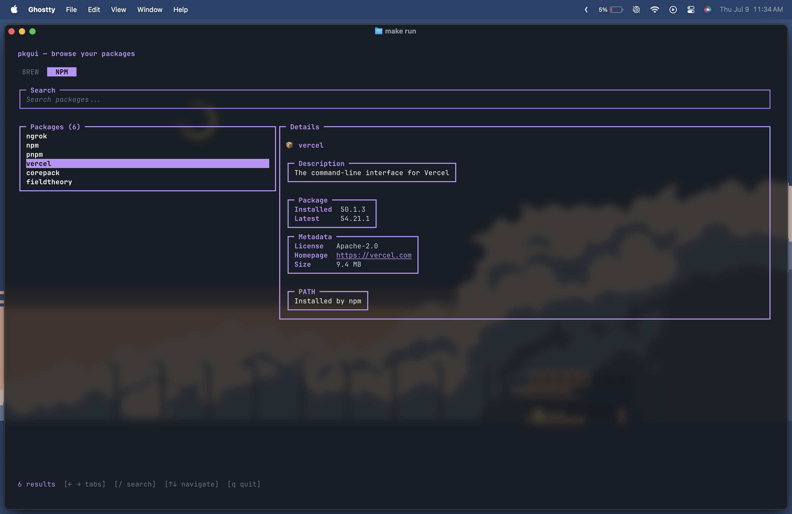

# pkgui

A terminal UI for managing packages across multiple package managers.

> Written in Go using [Bubble Tea](https://github.com/charmbracelet/bubbletea)

<br/>



<!---->

## Features

- List installed packages
- Fuzzy search installed packages (`/` to search)
- View package details:
  - version (installed/latest)
  - description
  - homepage
  - license
  - dependencies
  - installation path
  - binary size
- Scrollable package list with keyboard navigation
- Switch themes (5 theme palettes to select from)

## Roadmap

- [x] installed formulae
- [ ] installed casks/taps ([#29](https://github.com/bhavya-dang/pkgui/issues/29))
- [x] installed npm packages
- [ ] installed pip packages ([#20](https://github.com/bhavya-dang/pkgui/issues/20))
- [ ] upgrade/remove packages ([#3](https://github.com/bhavya-dang/pkgui/issues/3))
- [ ] search packages ([#19](https://github.com/bhavya-dang/pkgui/issues/19))
- [x] multi-theme support ([#9](https://github.com/bhavya-dang/pkgui/issues/9))
- [ ] persist user configuration ([#27](https://github.com/bhavya-dang/pkgui/issues/27))

## Currently Supported PMs

- **Homebrew** (formulae)
- **npm**

## Prerequisites

- [Homebrew](https://brew.sh)
- [npm](https://www.npmjs.com/)
- Go 1.25+ (if building from source)

## Installation

### Using Go

```bash
go install github.com/bhavya-dang/pkgui@latest
```

### Using install.sh

```bash
curl -sSL https://raw.githubusercontent.com/bhavya-dang/pkgui/refs/heads/master/install.sh | sh
```

### Using Makefile

```bash
git clone https://github.com/bhavya-dang/pkgui.git
cd pkgui
make install
```

### Manual

```bash
git clone https://github.com/bhavya-dang/pkgui.git
cd pkgui
go build -o build/pkgui .
cp build/pkgui "$GOPATH/bin/pkgui"
```

## Usage

```bash
pkgui
```

### Keybindings

| Key            | Action                         |
| -------------- | ------------------------------ |
| `↑` / `↓`      | Navigate package list          |
| `←` / `→`      | Switch between package managers (tabs) |
| `/`            | Toggle search (type to filter) |
| `t`            | Open theme selector            |
| `Esc`          | Exit search / close overlay    |
| `q` / `Ctrl+C` | Quit                           |

## Support

- Homebrew
  - installed formulae (with detail view from the Homebrew API)
- npm
  - installed packages

## License

MIT

## Contributions

I am actively working on this project. Feel free to raise any issues you find.
If you want to contribute something, let me know or raise an issue, fork the repo, and start contributing!
